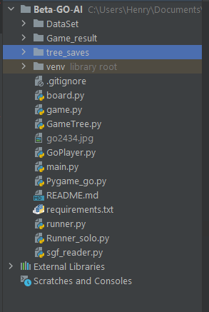
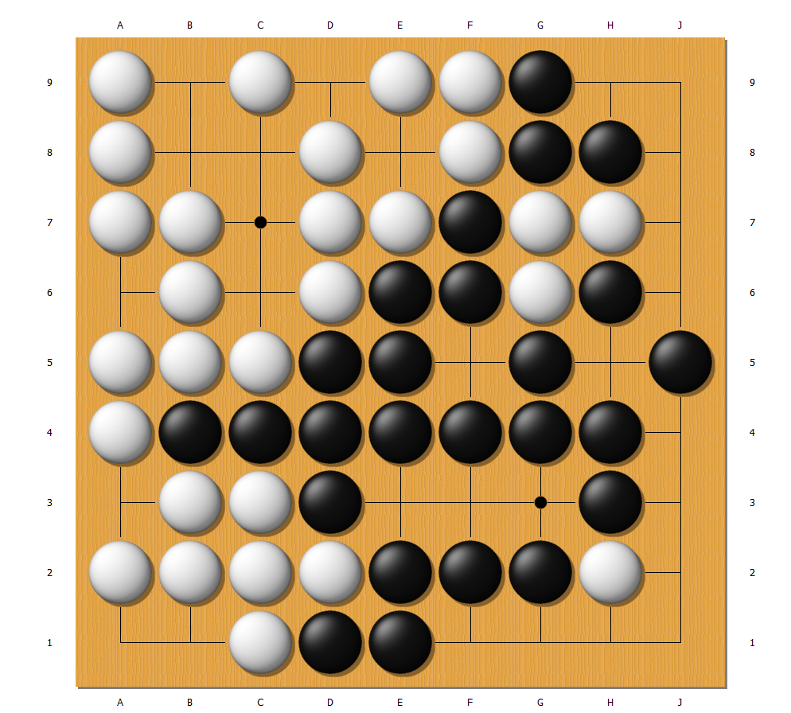
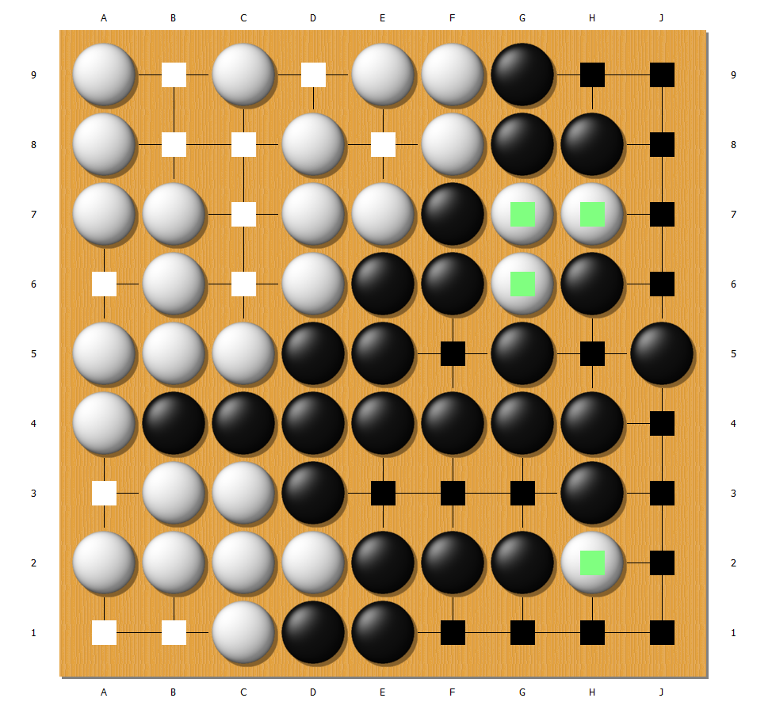
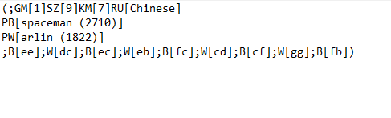

# Beta Go AI

# Problem Description and Research Question 

Our project is centered around the domain of the game Go. Go is a two
player board game that originated in China over 3000 years ago
(\"AlphaGo\"). The two players - one playing with black stones, one
playing with white stones - rotate placing stones of their respective
colour on the board, with the player with the black stones starting
first. The objective of the game is gain more points than your opponent
by the end of the game. Points come from both capturing your opponent's
stones, and from strategically surrounding spaces of territory. Once all
possible moves have been played, the board is scored and the player with
the greatest number of points wins.

Although the [rules](#sec:fn3) of the game are fairly simple, the game
itself is complex both for players and from a computational perspective.
On a standard 19 by 19 board, there are in fact 10 to the power of 170
unique possible board configurations, that's more than the number of
atoms in the known universe (\"AlphaGo\")! Hence, Go is a googol times
more complex than chess (\"AlphaGo\").

Henry has been playing Go for over a decade, and has represented Canada
at the 2018 World Youth Go Championship in Germany. Henry often uses [Go
AIs](#sec:fn2) to analyse his own games, but finds that they are often
slow and require significant computational resources. So, Henry wonders
if graphs and trees can be used to represent a game of Go and reduce the
computational complexity of analysing the game by examining the
structure of the game. Consequently, **the objective of our project is
to (1) represent a game of Go using graphs and trees, (2) develop
functions (such as scoring and finding dead stones) to operate on this
representation to assist users in analysing the game(s), (3) and
ultimately develop a basic AI to play the game and assist the user in
improving their play style**.

# Computational Overview 

The core of our computational strategy requires both a graph and a
decision tree. Graphs are used to represent the board, where each vertex
in the graph represents a unique positions on the board, with three
possible statuses (empty, black, white). Our \"empty board\" is
pre-generated with all the valid positions on the board populated by
\"neither\" stones which represents empty positions, with the valid
between positions on the board preset. The result is a very
interconnected graph that is like a network. The graph is supplemented
with a decision tree that stores many variations of moves. Note that we
are choosing to use a decision tree rather than a linked list here, as
we plan on allowing the user to analyse their game using our software,
and to return to previous moves and try out new variation without
overwriting the original sequence. Moreover, setting it up as a decision
tree is important for implementing a rudimentary AI, which utilises a
pre-generated \"GameTree\" - a tree of many variations of moves - to
choose the next move it should play. This tree is generated based on our
data set of thousands of previous Go games, which keeps track of the
\"likely hood of winning\" for each possible move. Out of curiosity and
for analysis purposes, we are employing two different methods for
determining this attribute: The first method calculates a \"win rate\"
based purely on whether that particular sequence of moves resulted in a
win or a lose for black. Our other implementation also considers the
\"score\" of each sequence, in which the amount of points at which black
won or lost by also influences the value (see Discussion section for the
results).

In addition, to reduce the computational complexity of the task, we have
focused on implementing our project on a smaller 9 by 9 board. However,
most of our classes/functions allow for different board sizes - such as
19 by 19 which is the most popular. So if the user desires to test out
larger board sizes, it will still be possible, but the trade off is that
generating large trees requires significantly more running time for the
user.

Furthermore, to give our AI a head start during its initial training
phase, we are using multiple data sets of thousands of real world games,
where each game is stored as an \"sgf\" file ([Smart Go
Files](#sec:fn1)) - see Figure 3 for an example of the data (Yamashita).
We have developed multiple algorithms to process the Smart Game Files,
which are capable of isolating the data which we are concerned with,
primarily the sequences of moves and the result of the game and board
size. These algorithms allow us to pre-generate large GameTrees which
our AIs can use, and pre-generating these trees saves significant
running time for the TA.

New Python Libraries:\
- *os* for parsing through and opening files:\
The os module to manage files through python code. More specifically, we
will use to scan for game files in a folder with os.listdir(), filtering
them (files can be moved with shutil.move() basically just uses
os.rename()), and removing deprecated ones with os.remove(). It is
extremely useful because it allows us to manipulate thousands of files
with just a few lines of code and lets us make full use of our
datasets.\
- *Sgfmill* for loading sgf files and creating game objects:\
Usage of this library is not strictly necessary for the user. But we
would like to acknowledge that we leaned on this library initially for
its plethora of pre-implemented functions for process sgf files, such as
sgfmill.sgf_moves.set_initial_position()). It was helpful for testing
purposes, but was eventually phased out for our own methods which better
fit our needs.\
- *pygame* for outputting visuals to the user:\
Although pygame has been covered extensively in class, we have used some
functions for getting active events (cursor position, mouse clicks, etc)
which was less covered in class.\
- *Pillow* for manipulating images:\
Used for creating (image.paste, image.draw, etc) and saving (image.save)
.jpg pictures.

# Dataset 

\*All go games are stored as .sgf files, see appendix for more info

Go game datasets were optained from: Yamashita, Hiroshi. "Go Quest game
records 9x9 and 13x13." - see works cited\
2015-Go9: Contains a data set of which originally contained some 9000
games (board size 9x9) selected from the top 50 players online up until
2015. We have pre-filtered any invalid games (non-complete/no score,
resigned games, etc) where we do not have a complete game with a final
score (so the actual number of games should be less).\
2015-Go9-small: A subset of 2015-Go9, which contains a data set of a
couple hundred games for faster running times during testing.\
2015-Go-super-small: A subset of 2015-Go9, which contains a data set of
just 5 games for faster running times during testing.\
2019-1255games: A data set of some 1255 games (board size 9x9) selected
up until 2019. We have pre-filtered any invalid games (non-complete/no
score, resigned games, etc) where we do not have a complete game with a
final score (so the actual number of games should be less).\
We have pre-generated using our algorithms the following GameTrees:\
completeScoreTree.txt: A pre-generated GameTree which contains the move
variations from our dataset of games, and the resulting \"likely hood of
winning\" for black based on how much black won or lost by.\
completeWinRate.txt: A pre-generated GameTree which contains the move
variations from our dataset of games, and the resulting \"likely hood of
winning\" for black based purely on whether black won or lost the game.\
recalcScoreTree.txt: A pre-generated GameTree which contains the move
variations from our dataset of games, and the resulting \"likely hood of
winning\" for black based on how much black won or lost by (we are
updating this tree with simulations).

# Instructions 

1\) As outlined in the project handout, download all necessary files
(PLEASE SEE THE COURSE EMAIL FOR THE DATASETS), install all things in
the requirements. Make sure that all files and folders are in the same
level/folder in your directory\
It should look something like this:\
{width="5cm"}\
2) Run our main.py, follow the prompts in the python console. Please
beware to follow the instructions carefully, as we have not implement
try-except blocks, so unexpected inputs could result in crashes.\
Break down of our functions:\
0) Exits the program\
1) Want to throw some stones on a board quickly, this is the function.
We recommend running this first to get an intuition of how the game
works. It will open a pygame window, click on the board to play moves,
close the window to end the game, see the python console for dialogue.
It will save and open the game as a png, where you can see the scoring
2) This option simulates one game of tree AI against a random guesser
(you can specify the length of the game) 3) This option simulates n
games of tree AI against a random guesser 4) This option simulates m
trials of n games of tree AI against a random guesser and plots the data
5) Outputs some useful/interesting data about our data sets in the
python console, might take some time. 6) Shows a experimental sub menu,
you can find some extra functions here for testing which are not
intended for users to actually use, feel free to try it.

NOTE: be careful of the images which are only for our latex document

# Changes 

While implementing our project, we realised that our functions could not
only analyse a singular game, but also a large set of games. For
instance, we could examine how long games typically take to be
completed, or what is the overall likely hood of black winning or losing
based on our data set. So, we implemented additional methods to collect
this data.

While implementing our functions, we began to realise the complexity of
the task at hand. For instance, where a \"perfect\" score calculator
might have been what we initially set out to achieve, it quickly became
clear that it was simply computationally infeasible - in fact, there's a
paper exploring this problem (Muller). So, we implemented a simplified
version which can score surrounded territory with relative accuracy,
which allows us to automate the evaluating of game results played
between AIs without manual intervention.

# Discussion

Overall, we are happy with the results of our project as it has more or
less accomplished the goals which we had initially set out to achieve in
our proposal. We have successfully represented a game of Go using graphs
and trees, and have developed algorithms that can exploit these data
structures to effectively accomplish their tasks. For instance, when
check whether a given stone is dead, instead of having to look over the
entire board, we can simply analyse the connected neighbours of the
stone in our graph, which reduces the complexity. Moreover, using trees
allows us to quickly follow a sequence of moves and generate
corresponding \"win likely hoods\", and reduces the complexity when our
AI is selecting a move as it simply needs to examine the children of
whichever node it is currently at. Thus, our project has shown that
trees and graphs can be used to model Go, and this form of model does
indeed reduce the overall complexity of operating on this model.

We have developed algorithms which can examine our database of games and
output useful/interesting data, such as overall win-rates and how long
games are lasting. The user might find this useful for analysing their
own games, as they can find patterns such as if they are stronger
playing as black or white (maybe they should work on improving the color
they are weakest at playing), or how long games typically last (if games
are overall not lasting very long, maybe the player is making too many
early mistakes and should improve their opening play style).

From our testing, we have found that our current implementation of our
AIs, when one colour wins, it tends to be by a significant margin.
However, when two AIs of the same level/implementation are paired up
against each other, the overall win-rate between the two colours is
around even. We do find that white has a very slight advantage, but that
makes sense given that white starts with an extra point bonus since
black plays first. So this shows that the advantage of playing first is
less significant than the point boost for our AIs. This is especially
prominent when both players are random guessing, which makes sense as
playing first should have minimal impact if you have no strategy in the
play style. We also find that our Tree based AI wins on average more
often than a AI that plays randomly, showing that our tree
implementation of AI does provide an advantage.

Ultimately, the most challenging component to this project is simply the
complexity of the game. Scoring the game is incredibly complex (Muller),
and in reality, Go AIs are implemented using neural networks. Our
scoring algorithm is limited in that although it is automated, it is
unable to determine when stones are dead if they appear in territory.
Thus, our scoring algorithm can be wrong sometimes, but in large numbers
of simulations, it should not favour either black or white. In the
future, we could attempt even further improvements to our scoring
algorithm for more accurate results.

Overall, to improve our AI further, we need to simulate more games to
create larger game trees, so that it resorts to random guessing less
often and less early. Currently, our tree AI only provides a slight
advantage over the random AI, but we have tested that generating larger
trees does result in better win-rates for our tree AI.

Another limitation in our project is that it primarily only supports 9x9
board sizes. Ultimately, expanding to larger sized boards (such as
19x19) would result in game trees which are simply too large to be
reasonable. This is a limitation in our modeling of the game, where a
tree is simply insufficient to properly model large variations and
sequences. Expanding our functions to better support other board sizes
would be a potential future improvement we could make.

Another major decision/challenge was determining when a game of Go
should end. Because of the rules of Go (see rules in appendix), the
end-game condition (when the game should end) is fairly vague, it is
basically when two players agree that there is no point in playing
further as neither side would benefit, and continued play might only be
detrimental to their scores. In a way, our simulation of games (making
AI play against itself) and the process using that data to construct our
game tree, is similar to decision trees in statistical analysis. After a
certain point, adding more stones to the board does not change the
situation much for both players, just like how when creating decision
trees in statistics, you want to avoid over fitting for your data-set.
Hence, to prevent this and to also make our simulations run faster, we
decided to implement an arbitrary cutoff after which the game ends. This
cutoff had to be a balance of performance (it would take too long all
simulated games would run for hundreds of moves) and accuracy (making a
cutoff too small would make simulations be too dissimilar to actual
games int the data-set). We tried 80th, 90th, and even 99th percentile.
In the end, we decided for it to be on 80th percentile - this way, the
cutoff covers 80 percent of our games. We then calculate that cutoff by
developing our own algorithms to find the average and standard
deviation. Rounding up, our final result was 68 moves total played.

Ideally, we should have a method of dynamically determining the current
score and how future moves might impact the score so that the AIs can
automatically decide when the game should end without the need for a
fixed hard stopping moving. This would improve the accuracy of our game
tree, and result in stronger Go AIs. Again, this is computationally
intensive, but could be another future improvement to our project.

# Appendix {#appendix .unnumbered}

Here is some optional additional reading for extra useful and
interesting details in our project.\
[]{#sec:fn3 label="sec:fn3"} Rules of the game (\"How To Play\"):\
1) The board is empty at the onset of the game (unless players agree to
place a handicap).\
2) Black makes the first move, after which White and Black alternate.\
3) A move consists of placing one stone of one's own color on an empty
intersection on the board.\
4) A player may pass their turn at any time.\
5) A stone or solidly connected group of stones of one color is captured
and removed from the board when all the intersections directly adjacent
to it are occupied by the enemy. (Capture of the enemy takes precedence
over self-capture.)\
6) No stone may be played so as to recreate a former board position.\
7) Two consecutive passes end the game. This occurs when both players
feel there is no possible beneficial moves remaining to be played.\
8) Using the Japanese rule set, the player's points consists of all the
area the player has surrounded and a point for each stone captured from
the opponent.\
9) Black was give white a \"komi\", which is a point penalty for
starting first, usually 6.5 points per Japanese rule set. Note that his
also prevents ties.\
10) The player with the most points wins!\
[]{#sec:fn2 label="sec:fn2"} Inspiration of the project:\
The primary inspiration for this project is the Alpha Go AI developed by
Deepmind and Google (\"AlphaGo\"). However, there has yet to be perfect
Go AI which was demonstrated a few weeks ago when an amateur player was
able to beat the current generation of Go AIs by exploiting flaws in the
algorithm (Xiang). So, we this project does not intend to develop a
perfect AI, but to create one that is at least statistically more
effective than random guessing.\
[]{#sec:fn1 label="sec:fn1"} Smart Go Files:\
Each game is stored as a Smart Game File (.sgf), which stores 4 rows of
information (Hollosi). The first few rows represent the header, which
contains basic information of the game, such as:\
GM: the game identification number\
SZ: the size of the board\
RE: the result of the game, which colour won and by how much\
KM: the komi of the game, the point penalty for black since they start
first\
RU: the rule set used, which has a minor influence on how the game is
scored (Chinese, Japanese, AGA)\
PW: the player playing with the white stones\
PB: the player playing with the black stones\
Next, the lines after the header contain key-value dictionaries, which
represent the tree of move variations in the game. This will usually
just be one dictionary, as a game is typically played sequentially with
only one long branch of moves. See figure 3 for an example\
Initial Work / Github:\
We will be using Github to coordinate our work in the group.

Figure 1: End state of game reached\
{width="5cm"}\
Figure 2: Example of scoring a game\
{width="5cm"}\
Figure 3: Example of Smart Go file converted to text.\

\
\

# Works Cited {#works-cited .unnumbered}

"AlphaGo." *DeepMind*,
<https://www.deepmind.com/research/highlighted-research/alphago>.
Accessed 7 Mar.\
.\
Hollosi, Arno. "SGF User Guide." *Redbean*, 12 Dec. 1999,\
<https://www.red-bean.com/sgf/user_guide/index.html>. Accessed 7 Mar.
2023.\
"How to Play." *British Go Association*,\
<https://www.britgo.org/intro/intro2.html>. Accessed 7 Mar. 2023.\
Rahul, Roy. "ML: Monte Carlo Tree Search (MCTS)." *GeeksforGeeks*, 5
July 2022,\
<https://www.geeksforgeeks.org/ml-monte-carlo-tree-search-mcts/>.
Accessed 7 Mar. 2023.\
Xiang, Chloe. "A Human Amateur Beat a Top Go-Playing AI Using a Simple
Trick." *Vice*, 24 Feb. 2023,\
<https://www.vice.com/en/article/v7v5xb/a-human-amateur-beat-a-top-go-playing-ai-using-a-simple-trick>.
Accessed 7 Mar. 2023.\
Yamashita, Hiroshi. "Go Quest game records 9x9 and 13x13." *EugeneWeb*,
28 Dec. 2015,\
<https://www.eugeneweb.com/pipermail/computer-go/2015-December/008353.html>.
Accessed 7 Mar. 2023.\
Muller, Martin. \"Counting the Score: Position Evaluation in Computer
Go.\" *University of Alberta*,\
<https://webdocs.cs.ualberta.ca/~mmueller/ps/goeval.pdf>. Accessed 4
April. 2023.\
